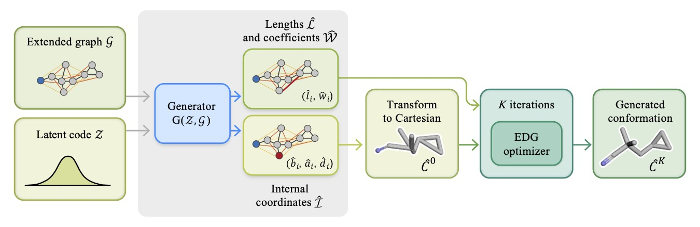

# COSMIC: Molecular Conformation Space Modeling in Internal Coordinates with an Adversarial Framework

Implementation of [COSMIC](https://pubs.acs.org/doi/full/10.1021/acs.jcim.3c00989) by Maksim Kuznetsov*, Fedor Ryabov*, Roman Schutski*, Rim Shayakhmetov, Yen-Chu Lin, Alex Aliper, and Daniil Polykovskiy.




## Requirements and data preprocessing

To build Docker image and install requirements, run:

```
docker build -t {IMAGE_NAME} ./docker/
docker run -v ./:/COSMIC -shm-size 16G --memory=16G -it --name {CONTAINER_NAME} {IMAGE_NAME}
```

Also, download the GEOM dataset using the following [link](https://doi.org/10.7910/DVN/JNGTDF) and preprocess it with the following command

```
GEOMDS=/path/to/geomdataset

mkdir $GEOMDS/rdkit_folder/drugs_sdf/
python ./COSMIC/scripts/preprocess_dataset.py --root=$GEOMDS/rdkit_folder --summary_file=summary_drugs.json --new_summary_file=summary_preprocessed.json

mkdir $pathtogeomdataset/qm9_sdf/
python ./COSMIC/scripts/preprocess_dataset.py --root=$GEOMDS/rdkit_folder --summary_file=summary_qm9.json --new_summary_file=summary_qm9_preprocessed.json
```

## Training

To train the models in the paper, run this commands:

GEOM-Drugs dataset experiments
```
python COSMIC/scripts/train.py --root=$GEOMDS/rdkit_folder --summary_path=$GEOMDS/rdkit_folder/summary_preprocessed.json --num_workers=8 --num_epochs=6 --gpu=... --conditions=none --model=aae_wgan --batch_size=256
python COSMIC/scripts/train.py --root=$GEOMDS/rdkit_folder --summary_path=$GEOMDS/rdkit_folder/summary_preprocessed.json --num_workers=8 --num_epochs=6 --gpu=... --conditions=descriptors3d --model=aae_wgan --batch_size=256
```

GEOM-QM9 dataset experiments
```
python COSMIC/scripts/train.py --root=$GEOMDS/rdkit_folder --summary_path=$GEOMDS/rdkit_folder/summary_qm9_preprocessed.json  --num_workers=8 --num_epochs=60 --gpu=... --conditions=none --model=aae_wgan --batch_size=256 --dataset=qm9 
```

To track training metrics, you can run Tensorboard:

```
tensorboard --logdir=logs/ --bind_all
```


## Evaluation

To sample conformations and compute metrics, please, use notebooks in `notebooks` folder.

## Video overview

[](https://youtu.be/xZANU8M7RzI)

## Citation

```
@article{kuznetsov2024cosmic,
author = {Kuznetsov, Maksim and Ryabov, Fedor and Schutski, Roman and Shayakhmetov, Rim and Lin, Yen-Chu and Aliper, Alex and Polykovskiy, Daniil},
title = {COSMIC: Molecular Conformation Space Modeling in Internal Coordinates with an Adversarial Framework},
journal = {Journal of Chemical Information and Modeling},
doi = {10.1021/acs.jcim.3c00989},
note ={PMID: 38668753},
URL = {https://doi.org/10.1021/acs.jcim.3c00989},
eprint = {https://doi.org/10.1021/acs.jcim.3c00989}
}
```